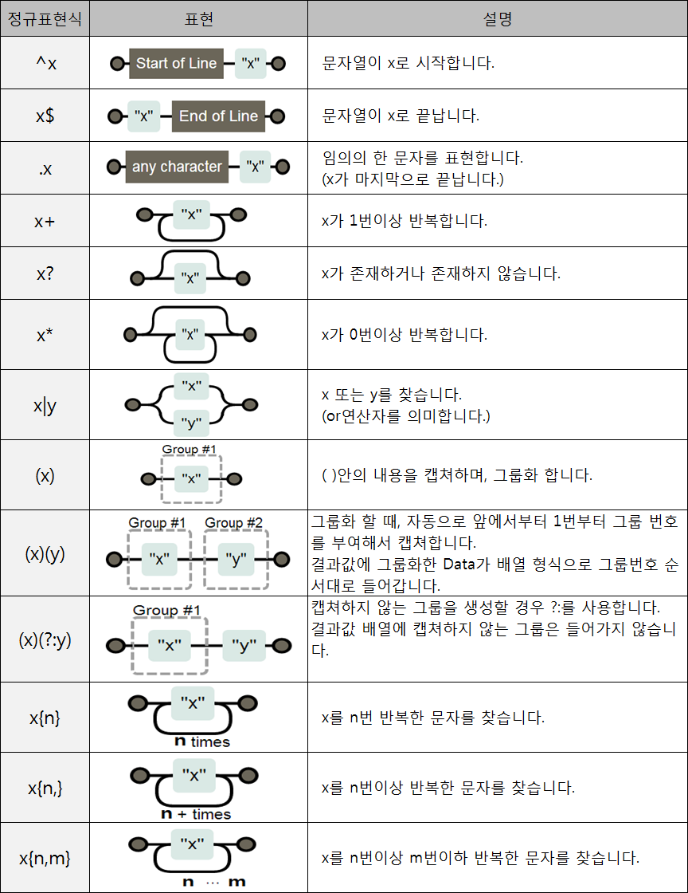

# 정규식 


1. 정규식 UML  


2. 정규표현식 표현방법  
수 많은 정규 표현식이 존재하며 약간의 차이점이 존재하나 거의 비슷하다. 대표적인 표현식은 POSIX아 PCRE 가 있다.
 * POSIX : 표준 정규표현식 
 * PCRE : POSIX 정규 표현식에서 확장된 Perl 방식 




3. 정규표현식 Flag  
만약 Flag를 설정 하지 않으면 문자열 내에서 검색 대상을 많더라도 한번만 찾는다.

    |Flag | 설명 |
    |-----|------|
    |`g` | Global : 문자열 내의 모든 패턴을 찾는다.|
    |`i` |Ignore Case : 문자열의 대소문자를 구별하지 않는다. |
    |`m` |Multi Line : 문자열이 행이 바꿔어도 찾는다. |
    |x | 공백을 무시하고 주석을 허용 |
    |s |개행문자도 포함해서 찾는다. |


4. 사용방법 (javascript)  
javaScript 버전이 1.1이하 버전일 경우에는 정규표현식을 사용할 수 없습니다

* RegExp 객체 이용 하기  
정규표현식이 자주 변경 될 경우 
```
// RegExp 객체를 이용하는 방법
var regExp = new RegExp('정규표현식',['Flag']); 
```

* 객체초기화  
정규표현식이 바꾸지 않을 경우 사용
```
// 객체초기화(Object initializer) 방법
var regExp = /정규표현식/[Flag];  
```

## 정규식 Utility
> http://www.regexr.com/  
> 정규식 시각화 : http://www.regexper.com/  
> http://gskinner.com/RegExr/  
> Ruby 기반 : http://rubular.com  
> java 기반 : http://www.regexplanet.com/advanced/java/index.html  
> 정규식 추천 : http://txt2re.com/index.php3


# zvon.org 정규식 강의
http://zvon.org/comp/r/tut-Regexp.html#Pages~Contents

## 참고 URL
> http://zvon.org/comp/r/tut-Regexp.html#Pages~Contents  
> https://opentutorials.org/course/909/5143  
> http://www.nextree.co.kr/p4327/  